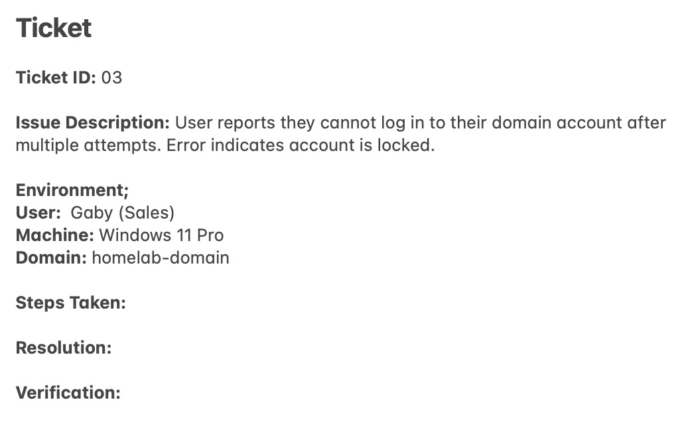
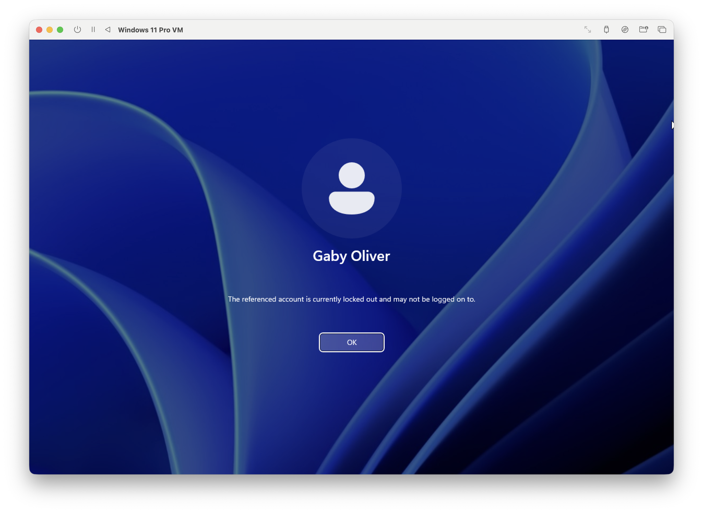
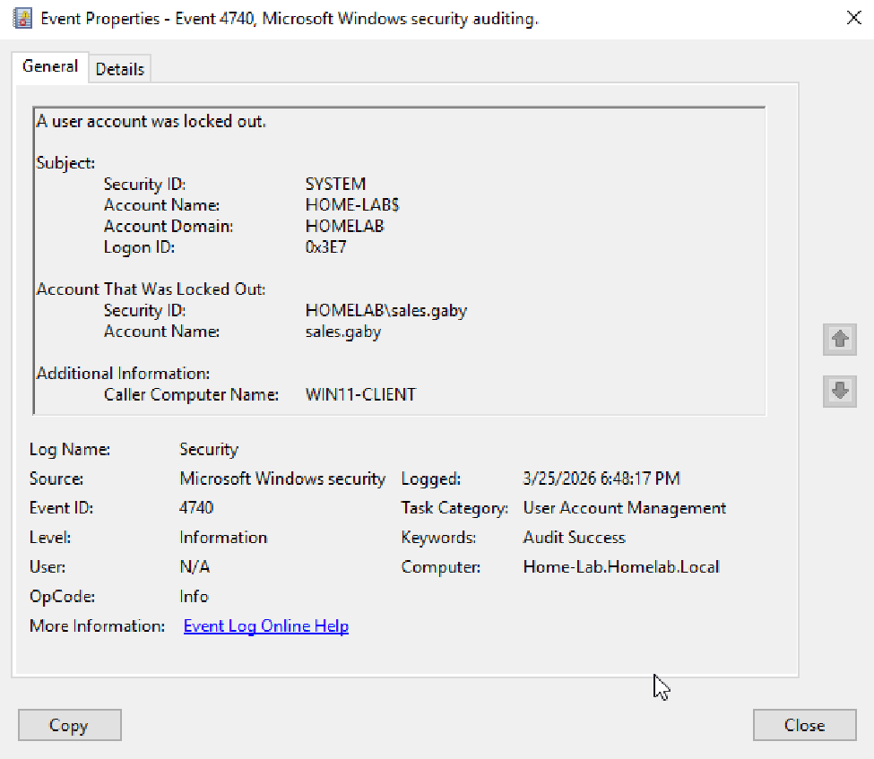
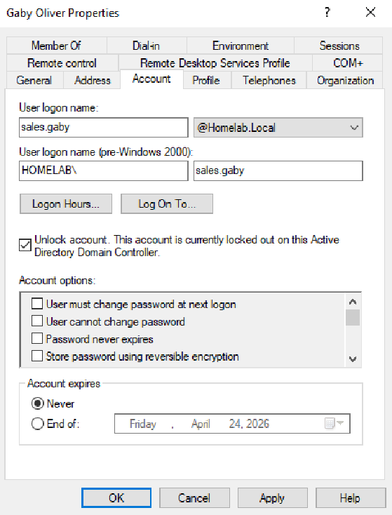
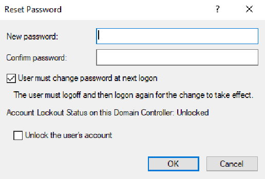
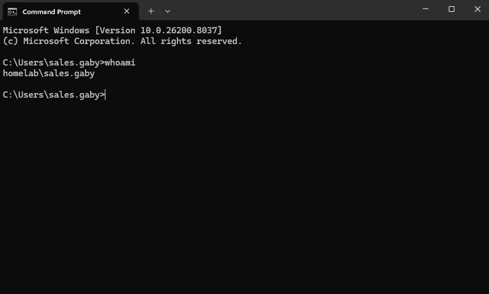
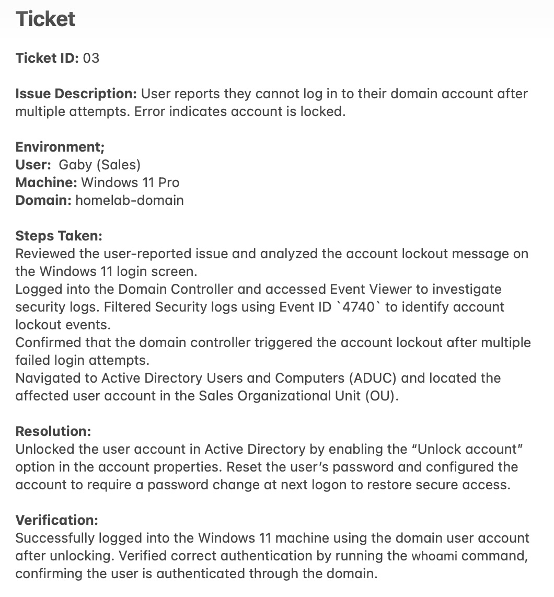

# Account Lockout Troubleshooting Lab

## Objective
Simulate and troubleshoot a real-world IT support ticket where a user account has been locked out in Active Directory after repeated failed sign-in attempts. Unlock the account and confirm the successful logon.

---

## Lab Environment
- Windows Server 2019 Virtual Machine
- Windows 11 Pro Virtual Machine  
- Active Directory Domain Services (AD DS)  
- Active Directory Users and Computers (ADUC)
- Event Viewer

---

## Ticket
User reports they cannot log in to their domain account after multiple attempts. Error indicates account is locked. Support ticket has been received.



---

## Steps

### 1. Identified the Problem
User sent screenshot of their screen notifying her account being locked out after multiple sign-on attempts. 



---

### 2. Established a Theory of Probable Cause
Formed an hypothesis that the Active Directory Domain Controller locked account for security reason, surpassing the lockout threshold of logon attempts. 

---

### 3. Tested the Theory
Opened and navigated through the Windows Server → Tools → Event Viewer → Windows Logs → Security and filtered the current log with Event ID code `4740` for locked out account. The users Account Name and Task Category confirmed it was an Active Directory Domain Controller lockout.



---

### 4. Established a Plan of Action and Implemented the Solution
Established a plan to unlock the user's account in Active Directory Users and Computers. The plan includes resesting the password, and enforcing password change at next logon. Opened and navigated through Active Directory Users and Computers → Domain → Users → Employees → Sales (OU) → Gaby → Account Properties and checked "Unlock account". Reseted the password, enforcing a password change at next logon to restore secure access.





---

### 5. Verified Full System Functionality
Verified by successfully logging into the Windows 11 machine using the domain account. Confirmed the logged-in user using the `whoami` command.

**Comamand Used**
```
whoami
```



---

### 6. Documented Findings, Actions and Outcomes
Documented the issue, troubleshooting steps, resolutions and verification results in the support ticket for future reference and auditing. Ticket closed.



---

## Key Takeaways
- Account lockouts occur after exceeding failed login attempts defined by domain policy
- Event Viewer (Event ID 4740) is used to identify and confirm account lockout events
- Active Directory Users and Computers is used to unlock accounts and reset passwords
- Resetting the password and requiring a change at next logon restores secure access
- Verifying login and using `whoami` confirms successful domain authentication
- Following a structured troubleshooting process ensures accurate resolution and documentation
